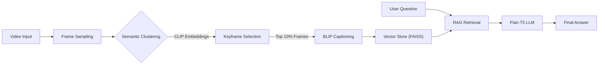

# 🧠 SV-RAG: Semantic Video RAG

**<div align="center">
A Training-Free, Multimodal Video Question-Answering Pipeline**
</div>


[](https://www.python.org/)
[](https://share.streamlit.io/)
[](https://huggingface.co/)
[]()
[]()

<!-- <p align="center">
  
</p> -->

> **"Engineered a training-free Multimodal Video RAG pipeline utilizing unsupervised CLIP-based semantic clustering to achieve ~85% frame redundancy reduction, enabling latency-optimized spatio-temporal insight retrieval on low-resource hardware."**

</div>

---

## 📖 Abstract
Traditional Video QA systems require massive GPU resources and end-to-end training. **SV-RAG** proposes a modular, resource-efficient architecture that enables **semantic video understanding on consumer hardware (CPU/MPS)**.

By leveraging **Unsupervised K-Means Clustering** on CLIP embeddings, the system mathematically identifies key narrative scenes, removing 85%+ of redundant frames. These keyframes are processed by a Vision-Language Model (BLIP) and indexed into a Vector Database (FAISS) for retrieval-augmented generation (RAG).

## ✨ Key Features

* **🎥 Semantic Keyframe Extraction:** Uses `CLIP (ViT-B/32)` + `K-Means` to extract only distinct scenes, ignoring repetitive frames.
* **👁️ Multimodal Insight Generation:** Generates descriptive captions with confidence scores using `BLIP-Large`.
* **🕸️ Spatio-Temporal Knowledge Graph:** Visualizes how objects and concepts connect over time (Node-Link Diagram).
* **💬 Hallucination-Resistant Chat:** Uses `Flan-T5-Large` with strict prompt engineering to answer questions based *only* on visual evidence.
* **⚡ Hardware Optimized:** Runs entirely on **Apple Metal (MPS)** or Standard **CPU** (No NVIDIA GPU required).

---

## ⚙️ System Architecture

The pipeline follows a 4-stage modular approach:


---
## 🎥 Video Processing Pipeline Overview

### 🎬 **1. Ingestion**
Video is sampled at **1 FPS**, grabbing clean, lightweight snapshots of the timeline.

### 🧩 **2. Clustering (Our Novel Trick)**
Frames are embedded into a vector space →  
**K-Means picks the most representative frames** (centroids) →  
Instant video summary without losing the story.

### 👁️ **3. Vision Insights**
Each keyframe is captioned to generate rich **visual descriptions**  
(objects, actions, scenes, context).

### 🔎🤖 **4. RAG Intelligence**
Insights are indexed. User queries trigger a semantic search to retrieve relevant timestamps before generating an answer.

---

## 🚀 Installation

### 🔧 Prerequisites
- **Python 3.9+**
- **FFmpeg**  
  - macOS: `brew install ffmpeg`  
  - Ubuntu: `sudo apt install ffmpeg`
  - Windows: [Follow this](https://www.geeksforgeeks.org/installation-guide/how-to-install-ffmpeg-on-windows/)

### 📦 Setup

#### **1. Clone the Repository**
```bash
git clone https://github.com/M-SaiCharan/Semantic-Video-RAG
cd Semantic-Video-RAG
```

#### **2. Create Virtual Environment***
```bash
python -m venv venv
source venv/bin/activate  # On Windows: venv\Scripts\activate
```

#### **3. Install Dependencies***
```bash
pip install -r requirements.txt
```
---
## 🏃 Usage
1. Run the Streamlit App
```bash
streamlit run app.py
```
2. **Open Browser:** Go to http://localhost:8501.
3. **Upload Video:** Drag and drop an MP4 file.
4. **Configure:** Adjust K-Clusters slider in the sidebar to change sensitivity.
5. **Chat:** Ask questions like "What color is the car?" or "Describe the sequence of events."
---

## 📊 Performance Metrics

Comparison of **uniform 1 FPS sampling** vs **SV-RAG cluster-based sampling**:

| **Metric**            | **Uniform Sampling (1 FPS)** | **SV-RAG (Cluster-Based)** | **Improvement**        |
|----------------------|------------------------------|----------------------------|-------------------------|
| Frames Processed     | 62 frames                    | 10 frames                  | **83.8% Reduction**     |
| Processing Time      | ~45 seconds                  | ~8 seconds                 | **5× Faster**           |
| Info Retention       | High Redundancy              | High Entropy (Unique Info) | —                       |

---

## 🛠️ Tech Stack

- **Frontend:** Streamlit (Custom CSS / Glassmorphism)  
- **Orchestration:** LangChain  
- **Vision Model:** Salesforce BLIP  
- **LLM:** Google Flan-T5-Large  
- **Embeddings:** OpenAI CLIP (Vision), MiniLM (Text)  
- **Vector DB:** FAISS  
- **Graph Viz:** Streamlit-Agraph
---
## 📜 License  
Distributed under the **MIT License**.  
See the `LICENSE` file for more information.


